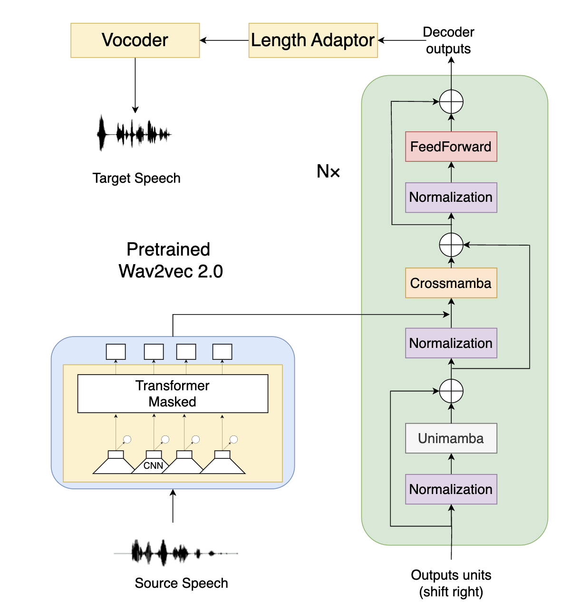

# Mamba-Decoder-based-s2st
An implementation of Mamba decoder for Speech-to-Speech Translation(S2ST) used CVSS Fr-En Corpus

## Architeture


## Step
The first step is to download French dataset from [Common Voice (version 4)](https://commonvoice.mozilla.org/ja).
Then downloading the corresponding English of the [CVSS dataset](https://github.com/google-research-datasets/cvss)

you need to install speechbrain toolkit used 

`pip install speechbrain`

you can get more information from [speechbrain](https://github.com/speechbrain/speechbrain)

Then you should move the module/MambaS2ST.py to "speechbrain.lobes.models.transformer" folder.

Last, use commands:

```python
python train.py hparams/train_fr_en.yaml

to train the model
